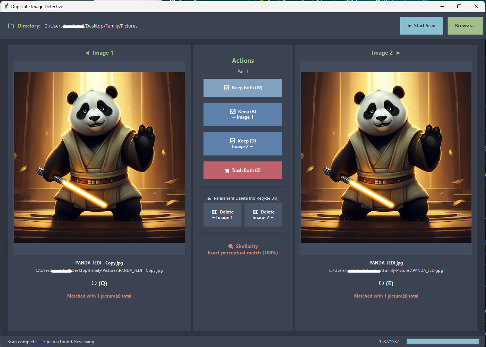
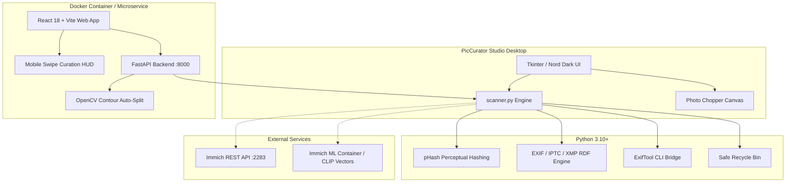

# PicCurator Studio 🔍🎨

> **✨ Vibe coded** — Built entirely through conversational AI-assisted development (vibe coding) using [Antigravity by Google DeepMind](https://deepmind.google).

A comprehensive photo curation, duplicate elimination, metadata tagging, and collection management suite. Designed for organizing massive personal image archives, digitizing scanned photo albums, and integrating seamlessly with self-hosted **[Immich](https://immich.app/)** media servers.

Available as both a high-performance **Windows Desktop Application** and a containerized **Web & Mobile Curation Suite** (FastAPI + React).

---

## 📸 Screenshots



---

## 🌟 Key Features

### 1. 🔍 Duplicate Scanner & Cluster Resolution
- **Perceptual Hashing (pHash):** Detects visually identical photos even across differing resolutions, quality settings, or compression formats (customizable distance threshold $\le 6$).
- **AI Semantic Scanning:** Leverages an Immich Machine Learning container (`clip-vit-base-patch32`) to generate vector embeddings and identify semantically identical or near-duplicate shots with local vector caching.
- **Cluster Grouping:** Groups 2, 3, 4+ duplicates together for simultaneous multi-image comparison rather than forcing isolated 1-to-1 pairs.
- **Synchronized Zoom & Pan:** Smooth scroll-wheel zoom anchored to the cursor position (up to 12×) with responsive pan.
- **High-Speed WASDQE Workflow:** Review and triage hundreds of duplicate clusters in minutes using hotkeys.

### 2. 🖼️ Sequential Image Viewer & Photo Chopper
- **Folder-by-Folder Browsing:** Traverse entire directories sequentially without reloading.
- **Lossless Rotation:** Quick 90° clockwise rotations preserving EXIF, XMP, and ICC profiles.
- **Built-in Photo Chopper (✂ Save Chops):** Scanned an album page with multiple photos? Draw rectangular selection boxes directly over the canvas to split and extract each photo into its own file with orientation and metadata intact.
- **Overlay Navigation:** Semi-transparent HUD arrows and smooth keyboard transitions.

### 3. 🏷️ Mass Edit & Hierarchical Tag Manager
- **Responsive Thumbnail Grid:** 5-column scrollable grid with multi-selection support (`Shift + Click`, `Ctrl + Click`, `Ctrl + A`).
- **Structured Tag Taxonomy:** Categorize keywords under `Names`, `Description`, `Location`, `Year`, or custom categories.
- **Hierarchical Tagging:** Full support for nested tags (e.g. `People/Jane Doe` $\rightarrow$ hierarchical tag `People/Jane Doe` + flat tag `Jane Doe`).
- **Set-Intersection Tag Inspector:** Instantly see which tags are shared across all selected photos versus partially assigned.
- **Bulk Operations:** Mass tag assignment, tag deletion, mass rotation, and bulk recycling.
- **Direct Viewer Jump:** Double-click any image in the grid to immediately open it in the Image Viewer.

### 4. ⚡ Immich Server Integration
- **Direct REST API Sync:** Connects directly to self-hosted Immich servers with live connection testing.
- **Server Duplicate Ingestion:** Pull duplicates identified on your Immich server directly into the native desktop duplicate reviewer.
- **Facial Recognition / People Browser:** Query recognized people from Immich and filter matched local files for targeted tagging.
- **CLIP Smart Search:** Natural language semantic searches run directly against your Immich server index.
- **Remote Album & Tag Management:** Create albums, assign remote tags, and push local assets directly to Immich.
- **Bidirectional Path Translation:** Automatically maps Immich server volume prefixes (e.g., `/mnt/backups/family_photos`) to local client storage paths.

### 5. 📱 Web & Mobile Curation Suite (FastAPI + React)
- **Dedicated Mobile Curation View:** Fullscreen swipe-based triage view (Tinder/carousel style touch gestures) for fast photo review on phones and tablets.
- **Superimposed Metadata HUD:** Overlay dates, descriptions, and tags directly over the photo preview.
- **OpenCV Auto-Split (`/api/split`):** Computer vision contour analysis that automatically detects and slices distinct printed photos on scanned pages.
- **Web-Based Manual Crop (`/api/crop`):** Interactive bounding box cropping via the web UI.
- **Untagged Photo Queue:** Filter and curate unorganized photos on demand.
- **Smart Image Downscaling & Caching:** Dynamically converts `.tif`/`.tiff` for browser display and downscales large images with mtime cache-busting.

### 6. 🛠️ Universal Metadata Engine & ExifTool Integration
- **Cross-Platform Metadata Sync:** Reads and writes metadata across all major photo ecosystems:
  - **Windows XP:** `XPKeywords` (`0x9C9E`), `XPComment` (`0x9C9C`)
  - **Standard EXIF:** `ImageDescription` (`0x010E`), `UserComment` (`0x9286`), `DateTimeOriginal` (`0x9003`), `ModifyDate` (`0x0132`)
  - **IPTC:** Keywords, Caption/Abstract, Date Created
  - **Adobe XMP RDF:** `dc:subject`, `lr:hierarchicalSubject` (Lightroom), `digiKam:TagsList`, `dc:description`, `photoshop:DateCreated`
- **ExifTool Integration:** Full support for reading and writing metadata to TIFF, raw formats, and files beyond Pillow's native EXIF writer.

### 7. 🛡️ Safe Deletion & Recycle Bin Mechanics
- **Zero Data Loss:** Trashed images are safely routed to the OS Recycle Bin (`send2trash`) or dedicated network backup folders (`/mnt/backups/recyclebin`).
- **Collision Protection:** Automatically renames recycled duplicates with UNIX timestamps (`photo_1728620000.jpg`) to prevent accidental overwrites.

---

## ⌨️ Keyboard Shortcuts

### Duplicate Review Mode (WASDQE)
| Key | Action |
|---|---|
| **W** | Keep All Images — skip to next cluster |
| **A** | Keep Image 1 — send other images to Recycle Bin |
| **D** | Keep Image 2 — send Image 1 to Recycle Bin |
| **S** | Trash All Images in cluster |
| **Q** | Rotate Image 1 (90° clockwise) |
| **E** | Rotate Image 2 (90° clockwise) |

### Image Viewer Mode
| Key | Action |
|---|---|
| **Right** / **D** / **Space** | Next image |
| **Left** / **A** | Previous image |
| **R** / **Q** / **E** | Rotate image 90° clockwise |
| **Delete** / **BackSpace** / **S** | Move current image to Recycle Bin |
| **T** / **M** | Focus tag / keyword input field |
| **Home** / **End** | Jump to first / last image |

### Mass Edit Mode
| Key | Action |
|---|---|
| **Shift + Click** | Select contiguous range of images |
| **Ctrl + Click** | Toggle individual image selection |
| **Ctrl + A** | Select all visible images |
| **Double Click** | Open image in Image Viewer |
| **R** / **Q** / **E** | Rotate all selected images 90° clockwise |
| **Delete** / **BackSpace** / **S** | Trash all selected images |
| **T** / **M** | Focus mass tag entry field |

---

## 📁 Supported Image Formats

| Format | Extensions | Metadata Read | Metadata Write |
|---|---|:---:|:---:|
| **JPEG** | `.jpg`, `.jpeg` | ✅ Full (EXIF, IPTC, XMP) | ✅ Full (Pillow & ExifTool) |
| **TIFF** | `.tif`, `.tiff` | ✅ Full (EXIF, IPTC, XMP) | ✅ Full (ExifTool) |
| **PNG** | `.png` | ✅ EXIF / XMP | ✅ EXIF / XMP |
| **WebP** | `.webp` | ✅ EXIF / XMP | ✅ EXIF / XMP |
| **BMP** | `.bmp` | ✅ Basic | ❌ (Format limitation) |
| **GIF** | `.gif` | ✅ Basic | ❌ (Format limitation) |

---

## 🏗️ Architecture & Tech Stack



---

## 🚀 Installation & Usage

### Option 1: Standalone Windows Executable (Zero Install)
Run the pre-compiled executable directly from the repository:
```powershell
.\dist\"PicCurator Studio v17.exe"
```
*(Or compile your own via `pyinstaller "picCurator Studio.spec" --clean --noconfirm`)*

---

### Option 2: Running the Desktop Application from Source

1. **Clone the repository:**
   ```powershell
   git clone https://github.com/pmitchell-dev/duplicate-image-detective.git
   cd duplicate-image-detective
   ```

2. **Set up a virtual environment and install dependencies:**
   ```powershell
   python -m venv .venv
   .\.venv\Scripts\Activate.ps1
   pip install -r requirements.txt
   ```

3. **Launch PicCurator Studio:**
   ```powershell
   python main.py
   ```

---

### Option 3: Running the Web & Mobile Curation Suite (Docker)

1. **Configure volume mounts:**
   Open [docker-compose.yml](file:///docker-compose.yml) and point the photo library volume to your local or network storage path:
   ```yaml
   volumes:
     - /mnt/backups/family_photos:/mnt/backups/family_photos
   ```

2. **Start the container:**
   ```bash
   docker compose up -d --build
   ```

3. **Access the interface:**
   - Desktop & Tablet Web UI: `http://localhost:8000`
   - Mobile Swipe Curation View: `http://<server-ip>:8000/#/mobile`
   - Interactive API Docs (Swagger): `http://localhost:8000/docs`

---

## ⚙️ Configuration

- **`immich_config.json`:** Persists your Immich Server URL, API Key, local path mapping, detection distance threshold, and tag history. Managed automatically via the desktop UI.
- **`tag_categories.json`:** Defines custom keyword categories and hierarchical taxonomy.
- **`config.ini`:** Optional settings for batch comparisons, SSIM/pHash thresholds, logging levels, and comparison report generation.

---

## 📄 License

This project is licensed under the **MIT License**.
